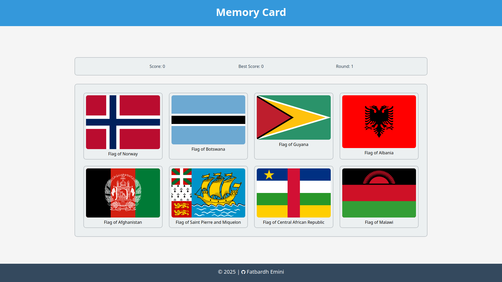

# Memory Card Game

A simple React memory card game featuring country flags. Test your memory by clicking on each flag only once per round. If you click on the same flag twice in a round, the game resets!

## Preview

 

## Features

- Dynamic country flag cards fetched from REST Countries API
- Score tracking with best score memory
- Multiple rounds of increasing difficulty
- Responsive grid layout

## Project Structure

The game is divided into reusable React components:

- **Card**: Individual flag card component
- **GameBoard**: Main game logic and card management
- **ScoreBoard**: Displays current score, best score, and round number
- **CountryAPI**: Handles API requests and country data management
- **Header & Footer**: Layout components

## Technologies Used

- React 
- REST Countries API
- CSS Grid for responsive layout
- React Hooks (useState, useEffect)

## Game Logic

- The game tracks which flags you've clicked in each round
- Clicking the same flag twice in a round resets the game
- Your best score is saved between game sessions
- Cards shuffle after each selection to increase difficulty

## Credits

- Flag images from [flagcdn.com](https://flagcdn.com)
- Country data from [REST Countries API](https://restcountries.com)